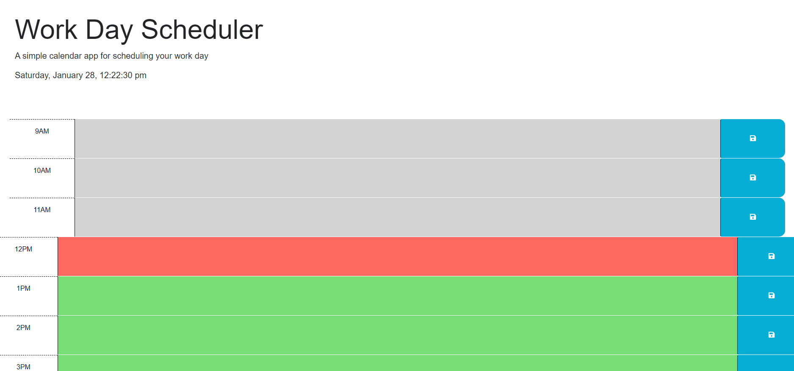

Thank you for reviewing my submission and for providing your feedback for my submission. Included in this README are links to other project repositories that I had worked on for this assignment. In some instances, I have reused code and/or modified it for my most recent submission. In many instances, I found it best to start over than continue where I was at from the previous coding session. Thank you again for grading my work and I will resubmit it again based off of the invaluable feedback you provide. 

This application is intended to be used as a Work Day scheduler. There is a time block for each hour asscoaited with business hours. Grey represens time blocks in the past; green for future; and red for the present hour. 

You will be able to save your inputs by clicking the save button and your entries will be there in local storage, even when the page is refreshed. 

Happy Scheduling! 

👽☯️

Submission  Link: https://sheogorath9.github.io/Third-Party-APIs-Challenge-Work-Day-Scheduler/ 

Screenshot

Previous Attempts:

https://github.com/Sheogorath9/Work-Day-Scheduler-Final

https://github.com/Sheogorath9/Work-Day-Scheduler-1

https://github.com/Sheogorath9/Work-Day-Scheduler